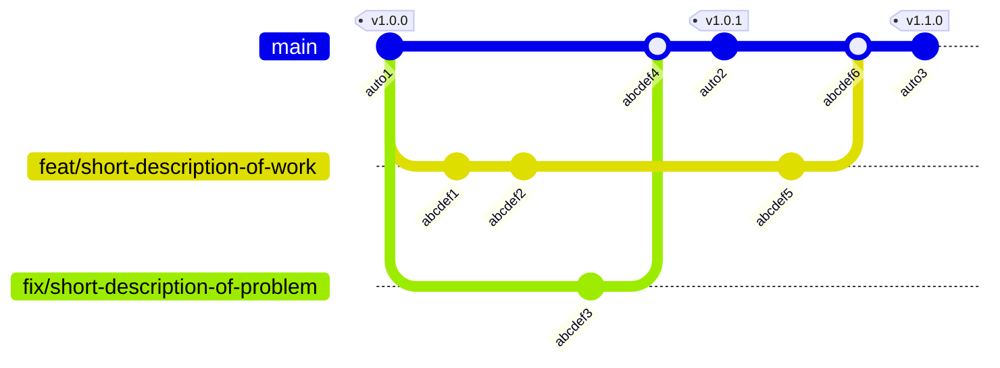

# Contribution Guidelines

**Thank you for considering to contribute to this project.**
We want to make onboarding as easy as possible, so we'll keep it short.
We are friendly, open and communicative!

## The Repository

This is intended to give you some structural guidance.

| Folder        | Purpose                                                     |
|---------------|-------------------------------------------------------------|
| src/          | Source code. Where you make edits most likely.              |
| test/         | Test code. Use `pnpm test` to execute them.                 |
| docs/         | Exact Documentation ("spec-driven"). Written in Markdown.   |
| dist/         | Generated build output.                                     |
| .github/      | Continuous integration workflows and more.                  |

We try to keep dev dependencies to a minimum.
We try to keep (runtime) dependencies to zero.

## The Commands

This is intended to give you a quick but complete overview.

| Cmd           | Purpose                                         |
|---------------|-------------------------------------------------|
| `pnpm build`  | Run esbuild, bundling from 'src/' to 'dist/'.   |
| `pnpm test`   | Run all tests under 'test/'.                    |
| `pnpm run test:coverage` | Run the same tests, writing an lcov and a JUnit report to 'coverage/'. Needs Node 22.5 or newer; `pnpm test` does not. |

The coverage run measures 'src/' alone, and every file in it has to be reachable from the test suite - an unreachable one is never loaded, so it would silently leave the measurement rather than lower it. The run fails when that happens.

## Our Workflow

We are using [GitHub↗](https://github.com/).

We are following [conventional commits↗](https://www.conventionalcommits.org/en/v1.0.0/).
That means using the format `<type>: <short description of work>` for every commit.
Try to adapt a similiar pattern for branch naming please.

We are using [merging over Pull Requests (PRs)↗](https://github.blog/developer-skills/github-education/beginners-guide-to-github-merging-a-pull-request/) from feature-branches.
Every PR is being [merged in as a commit↗](https://docs.github.com/en/pull-requests/collaborating-with-pull-requests/incorporating-changes-from-a-pull-request/merging-a-pull-request); we do not squash the commits nor do we rebase anything directly on top of main without a merge commit.
A [mermaid git graph diagram↗](https://mermaid.ai/open-source/syntax/gitgraph.html) to visualize such a workflow:

### Some Constraints

Your commited `dist/` must match a fresh build.
You can verify this with `git diff --exit-code -- dist/`.

Never bump `package.json` version manually; releases are PR-label driven per GitHub workflow and bump that automatically (as you can see in the above mermaid diagram as well).

Write identifiers out in full; the abbreviations we do use are collected in [ABBREVIATIONS.md](ABBREVIATIONS.md).
