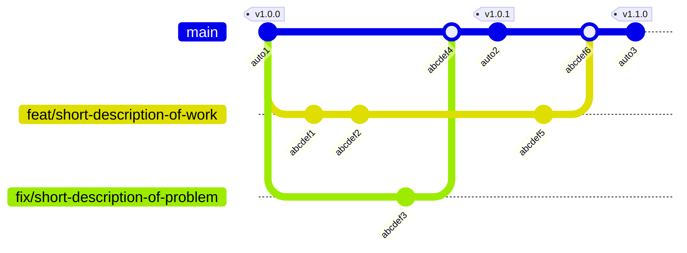

# Contribution Guidelines

**Thank you for considering to contribute to this project.**
We want to make onboarding as easy as possible, so we'll keep it short.
We are friendly, open and communicative!

## The Repository

This is intended to give you some structural guidance.

| Folder        | Purpose                                                     |
|---------------|-------------------------------------------------------------|
| src/          | Source code. Where you make edits most likely.              |
| tests/        | Integration tests and the e2e snapshots (`tests/e2e-expect/`). |
| docs/         | Exact Documentation ("spec-driven"). Written in Markdown.   |
| npm/          | The npm packages: the launcher and the platform binaries.   |
| .github/      | Continuous integration workflows and more.                  |

We keep dev dependencies to a minimum.
We keep runtime dependencies to the approved set: `regex`, `serde` and `serde_json`.

## The Commands

This is intended to give you a quick but complete overview.

| Cmd           | Purpose                                         |
|---------------|-------------------------------------------------|
| `cargo build` | Build the CLI.                                  |
| `cargo test`  | Run all tests, unit and integration.            |
| `cargo fmt --check` and `cargo clippy --all-targets -- -D warnings` | The lint gates CI enforces. |

CI additionally measures coverage with `cargo llvm-cov`, and every file under 'src/' has to appear in the measurement - a file missing from the report would silently leave the ratio rather than lower it, so the run fails when that happens (lib.rs, holding only module declarations, is the one exemption).

## Our Workflow

We are using [GitHub↗](https://github.com/).

We are following [conventional commits↗](https://www.conventionalcommits.org/en/v1.0.0/).
That means using the format `<type>: <short description of work>` for every commit.
Try to adapt a similiar pattern for branch naming please.

We are using [merging over Pull Requests (PRs)↗](https://github.blog/developer-skills/github-education/beginners-guide-to-github-merging-a-pull-request/) from feature-branches.
Every PR is being [merged in as a commit↗](https://docs.github.com/en/pull-requests/collaborating-with-pull-requests/incorporating-changes-from-a-pull-request/merging-a-pull-request); we do not squash the commits nor do we rebase anything directly on top of main without a merge commit.
A [mermaid git graph diagram↗](https://mermaid.ai/open-source/syntax/gitgraph.html) to visualize such a workflow:

### Some Constraints

Never bump a version manually - not in `Cargo.toml`, `Cargo.lock`, the `npm/` manifests, nor `CITATION.cff`; releases are PR-label driven per GitHub workflow and bump them all automatically (as you can see in the above mermaid diagram as well).

Write identifiers out in full; the abbreviations we do use are collected in [ABBREVIATIONS.md](ABBREVIATIONS.md).
